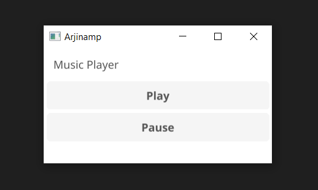

# Go Music Player

## Introduction

A simple music player built with Golang, featuring basic play and pause functionalities. This project leverages the beep library for audio playback and the Fyne library for the graphical user interface, providing an easy-to-use music player application.



## Technologies

- **Language**: Golang
- **Audio Playback**: Beep
- **Graphical User Interface**: Fyne
- **Version Control**: Git

## Setup Instructions

### Prerequisites

- Golang (https://golang.org/)
- Beep (https://github.com/faiface/beep/wiki/Hello,-Beep!)
- Fyne (https://fyne.io/)

### Installing

1. **Clone the repository:**

   ```bash
    git clone https://github.com/ArjinAlbay/go-music-player.git
    cd go-music-player

   ```

2. **Install the necessary dependencies:**

   ```bash
    go get -u github.com/faiface/beep
    go get -u fyne.io/fyne/v2

   ```

### Running application

3. Start :
   ```bash
   go run main.go gui.go
   ```

## Usage

- Play: Click the "Play" button to start playing the music.
- Pause: Click the "Pause" button to pause the music.

## Contributing

Contributions are welcome! Please open an issue or submit a pull request for any improvements, bug fixes, or new features.

1. Fork the repository
2. Create a new branch (`git checkout -b feature/your-feature`)
3. Commit your changes (`git commit -m 'Add some feature'`)
4. Push to the branch (`git push origin feature/your-feature`)
5. Open a pull request

## License

This project is licensed under the MIT License - see the [LICENSE](LICENSE) file for details.

## My Social Media Accounts

<a href="https://twitter.com/arjinalbay" target="blank"></a>
<a href="https://linkedin.com/in/arjinalbay" target="blank"></a>

---
